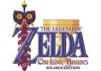

# Zelda Oni Link Begins

**Zelda Oni Link Begins _Solarus Edition_** is a remake of the original [Zelda Oni Link Begins](http://www.zeldaroth.fr), 
the second fangame by Vincent Jouillat, and the sequel of [Zelda Return of the Hylian](https://github.com/christopho/zelda_roth_se).
The original game was developed in C++ and released in 2007.

This new version is being developed with the [Solarus engine](https://github.com/christopho/solarus) by Christopho and Mymy.
While this is essentially the same game, a lot of details will be improved thanks to the use of Solarus.

The project is currently a work in progress and there is no release date planned yet.
